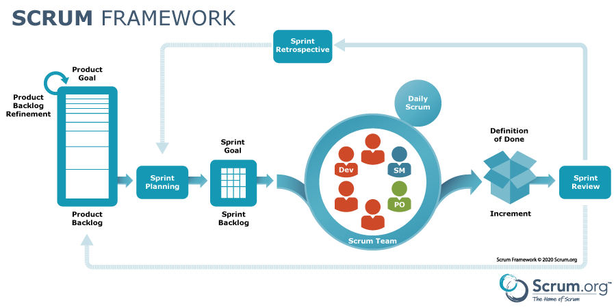

# Tiimin Scrum-opas

## Scrum-syklin yleiskuvaus

Scrum on ketterän kehityksen viitekehys, jossa työ jaetaan lyhyisiin sykleihin (*sprintteihin*).  
Jokaisen sprintin aikana tiimi toteuttaa valitut tehtävät, testaa niitä ja arvioi työn tuloksia.  
Tavoitteena on jatkuva arvon tuottaminen asiakkaalle ja nopea reagointi muutoksiin.

## Scrum kuvattuna

## Sprintit

- Sprintin pituus on yleensä 1-4 viikkoa. Me valitsimme projektillemme yhden sprintin kestoksi 2 viikkoa.
- Sprintin alussa suunnitellaan, mitä työjonosta toteutetaan.
- Sprintin lopussa pidetään katselmointi ja retro.
- Sprintti on aikarajattu → sisältö voi muuttua, mutta kesto ei.

## Sprintin rakenne
| Sprintin vaihe        | Kuvaus                          |
| --------------------- |:-------------------------------:|
| Sprint planning       | Suunnitellaan sprintin tehtävät |
| Daily scrum           | päivittäinen tapaaminen         |
| Sprint review         | Katselmus tuloksista            |
|Sprint retrospective   | Tiimin kehityskokous            |

## Työjonot

- **Product backlog**: lista kaikista kehitysideista, ominaisuuksista ja korjauksista. Pitää sisällään kaikki projektin tehtävät.  
- **Sprint backlog**: pitää sisällään yhdelle sprintille olennaiset tehtävät.
- **Seurantataulu**: jossa seuraamme tiimin työskentelyn etenemistä.

Tehtävät priorisoidaan niin, että arvokkain työ tehdään ensin.
  

## Roolit
- **Product Owner (PO)**: vastaa tuotteen visiosta ja priorisoi backlogia.  
- **Scrum Master (SM)**: huolehtii prosessista, poistaa esteitä ja tukee tiimiä.  
- **Kehitystiimi**: toteuttaa sprintin tehtävät, itseohjautuvasti ja moniosaajina.  

## Kokoukset
- **Sprint Planning**: Tässä asetamme sprintille olennaiset tehtävät ja tavoitteet. 
- **Weekly Scrum**: Viikoittainen tiimitapaaminen, jossa katsomme kuinka tiimin toiminta edistyy.
- **Sprint Review**: esitellään sprintin tulokset sidosryhmille.  
- **Sprint Retrospective**: tiimi arvioi prosessin ja sopii parannuksista.  

## Miksi Scrum toimii?

- Läpinäkyvyys: kaikki näkevät mitä tehdään ja miksi.  
- Iteratiivisuus: tuote paranee jatkuvasti pienissä osissa.  
- Itseohjautuvuus: tiimillä on valta ja vastuu työstä.  
- Jatkuva parantaminen: retroissa sovitaan kehityskohteista.  
- Nopeampi arvon tuottaminen asiakkaalle.  

## Sanastoa

- **Product Backlog**  
  Lista kaikista tunnetuista vaatimuksista ja kehityskohteista tuotteelle. Elävä dokumentti, jota Product Owner priorisoi.

- **Sprint**  
  Aikajakso (yleensä 1–4 viikkoa), jonka aikana tiimi toteuttaa valitun määrän tehtäviä ja toimittaa valmiin inkrementin.

- **Sprint Backlog**  
  Sprinttiin valitut tehtävät, jotka kehitystiimi sitoutuu tekemään.

- **Increment**  
  Sprintin lopputulos: toimiva, testattu ja julkaistavissa oleva kokonaisuus tuotteesta.

- **Daily Scrum**  
  Päivittäinen 15 minuutin tiimipalaveri, jossa seurataan edistymistä.

- **Scrum Master**  
  Henkilö, joka tukee tiimiä SCRUM-prosessin noudattamisessa, poistaa esteitä ja edistää jatkuvaa parantamista.

- **Product Owner**  
  Vastaa tuotteen arvon maksimoimisesta, priorisoi backlogia ja kommunikoi sidosryhmien kanssa.

- **Definition of Done (DoD)**  
  Tiimin yhteinen sopimus siitä, milloin työ katsotaan valmiiksi.

